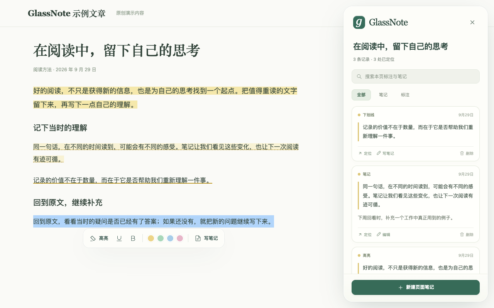
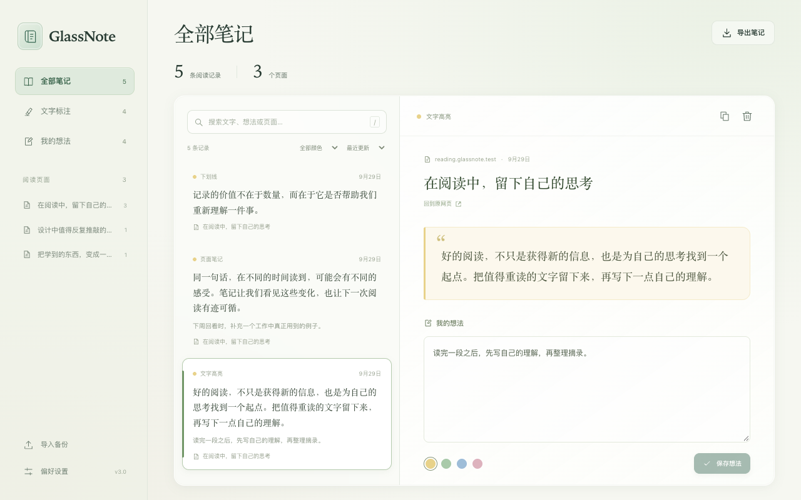

# GlassNote

[](https://github.com/aredddd/GlassNote/actions/workflows/ci.yml)
[](LICENSE)

GlassNote 是一个适用于 Edge 和 Chrome 的网页高亮与笔记扩展。选中文字即可标注、记笔记，并在下次打开网页时恢复。数据保存在自己的浏览器里。



## v3 改了什么

- **原文定位重新设计**：同时保存摘录、前后文和文本位置。刷新、重开、页面排版变化后重新寻找原文；重复句子无法可靠区分时，提示待定位，笔记仍可在列表中阅读。
- **不改网页内容**：通过 CSS Custom Highlight API 绘制高亮，不拆分或替换页面元素；隐藏标注不会隐藏原文。
- **统一保存**：后台串行处理所有写入，减少多标签页保存时的覆盖；失败会显示提示。
- **完整笔记库**：集中查看、搜索、编辑、删除笔记，以及导入、导出本地 JSON 备份。
- **轻盈的新界面**：玻璃质感工具栏、页面笔记面板和全新的扩展弹窗。

## 安装与升级

适用于支持 CSS Custom Highlight API 的桌面 Chromium 浏览器，最低内核版本为 Chromium 105。

已在 [Edge 商店上架](https://microsoftedge.microsoft.com/addons/detail/glassnote/kfmobkojmbkgpcglhlgnhembnoajjpjj)，可直接获取；也可使用下面的源码或 GitHub 安装包方式。

1. 从 [GitHub Releases](https://github.com/aredddd/GlassNote/releases) 下载 GlassNote-v版本号.zip 和 SHA256SUMS 并解压；也可下载仓库源码。
2. Edge 打开 edge://extensions/；Chrome 打开 chrome://extensions/，开启「开发者模式」。
3. 点击「加载已解压的扩展程序」，选择包含 manifest.json 的目录。
4. 刷新已打开的网页，选中文字开始标注。

**升级旧版前先导出备份。** 要沿用原来的扩展存储，请用新版文件替换原扩展目录，再在扩展管理页点击重新加载，保持原目录和扩展 ID，不要先卸载。如果安装到了新目录导致扩展 ID 改变，请在新版笔记库中导入旧版导出的 v2 JSON。

旧版原始存储键会保留。新版读取时合并旧 annotations、notes、elements，后续修改使用独立 v3 存储键。旧便签没有足够定位信息时，无法补回当时未保存的前后文；这类便签可能需要手动重新选取原文，但内容仍保留在笔记库。

## 使用

- 在普通网页选中文字，点击浮动工具栏高亮、加下划线或记录笔记。
- 高亮、下划线和加粗是开关：对同一处原文再次点击即可取消该格式。颜色圆点直接添加彩色高亮，换色会更新原记录，再点同色取消高亮；附带的笔记内容会保留。
- 点击扩展图标进入当前页面的标注控制，或打开「笔记库」。
- 页面笔记面板可以查看、编辑、删除笔记，并回到对应原文。
- Ctrl / Cmd + Shift + G 切换显示；Esc 关闭浮层。
- 默认自动恢复已有标注，可在笔记库设置中关闭。
- 导入采用合并方式；相同页面相同 ID 的记录保留本地版本，避免旧备份覆盖较新的编辑。

同一文章的普通章节锚点和常见追踪参数不会产生多份笔记；业务查询参数和以 #/、#! 开头的页面路由分别保存。普通 #name 被视为文章章节，如果网站用这种形式承载不同页面，需要注意它们会归入同一页面。



截图使用项目自编文章和演示笔记，不含真实用户数据。

## 适用范围

面向普通网页的主文档文本。浏览器内部页面、应用商店、浏览器内置 PDF 阅读器、Canvas 内容、iframe 内文和封闭 Shadow DOM 不在本版支持范围内。可编辑输入区不参与标注。访问本地 HTML 需要在扩展详情中开启「允许访问文件网址」。

网页删除或大幅改写原文时，无法保证自动重新定位；GlassNote 会保留摘录与笔记，并显示未定位状态。异步加载的原文会在内容出现后重试定位。

本版笔记内容按纯文本展示，旧笔记中的 Markdown 和 HTML 语法会原样保留，不作为网页代码执行。

## 数据与隐私

无需注册，不上传笔记，无分析统计服务。笔记保存在 chrome.storage.local；不要把浏览器本地存储当作唯一备份。导出的 JSON 包含网页地址、摘录和笔记，请自行妥善保存。

权限用于本地存储、当前页控制和在已打开网页中加载标注脚本。网页内容脚本覆盖 http、https 和用户允许的本地文件，不请求历史记录权限。

详细数据处理方式见[隐私说明](https://github.com/aredddd/GlassNote/blob/main/PRIVACY.md)。Edge 商店介绍、权限用途和审核步骤见[发布材料](https://github.com/aredddd/GlassNote/blob/main/docs/EDGE_STORE.md)。

## 开发与验证

扩展本身无构建步骤、无运行时依赖。开发和测试需要 Node.js 22 或更新版本及 npm，打包无需额外构建工具。CI 使用 Node.js 24 和 Playwright。使用扩展无需安装这些开发工具。

```sh
npm ci
npx playwright install chromium
npm run check
npm run format:check
npm test
npm run test:e2e
npm run package
npm run package:verify
```

可选运行指定真实站点的验收（需要联网）：

```sh
npm run test:live
```

该测试在临时浏览器配置中访问小林笔记的 Agent 专栏，结果和截图默认保存在 test-results。可用 GN_SCREENSHOT_DIR 指定输出目录。它不读取或修改个人 Chrome 配置。

Linux 首次安装测试浏览器时使用 npx playwright install --with-deps chromium。安装包生成在 dist/GlassNote-v版本号.zip，同目录生成 SHA256SUMS。打包只包含扩展文件及许可证、隐私与第三方说明，不包含 node_modules、测试和个人数据。测试使用独立的临时浏览器配置，不读取个人浏览器数据。

```text
src/
  background/  串行存储与迁移
  shared/      文本锚点、数据模型和消息接口
  content/     网页标注和页面笔记面板
  popup/       扩展弹窗
  library/     笔记库
styles/        网页高亮样式
tests/         存储、锚点与真实扩展回归
```

## 参与和发布

- [贡献指南](CONTRIBUTING.md)：开发流程、回归要求和 PR 约定。
- [问题反馈](https://github.com/aredddd/GlassNote/issues/new/choose)：Bug 报告和功能建议。
- [安全政策](SECURITY.md)：通过私密渠道报告漏洞。
- [更新日志](CHANGELOG.md)与[版本发布流程](docs/RELEASING.md)。
- [贡献者](CONTRIBUTORS.md)。

## 许可

本项目采用 [MIT 许可证](LICENSE)，版权归 aredddd 及项目贡献者所有。开发工具、浏览器和测试网站的许可边界见[第三方声明](THIRD_PARTY_NOTICES.md)。
